# NODEx: Next-Gen Layer 2 Scaling for Solana

<div align="center">
  
  <p><strong>Revolutionizing Solana's scalability through advanced Layer 2 solutions</strong></p>
</div>

## ✨ Features That Bend Reality

<table>
<tr>
<td align="center">🔥 AI-Powered Scaling</td>
<td align="center">🌉 Neural Bridges</td>
<td align="center">🔐 Quantum-Safe Security</td>
</tr>
<tr>
<td align="center"></td>
<td align="center"></td>
<td align="center"></td>
</tr>
<tr>
<td align="center">Batch 100k+ TPS with contextual AI optimization</td>
<td align="center">Self-learning bridges connecting Solana↔Polkadot↔Ethereum</td>
<td align="center">ML-powered threat detection + zero-knowledge proofs</td>
</tr>
</table>

## 🧠 Architecture Overview

```mermaid
graph TD
  A[User Transactions] --> B{NODEx AI Optimizer}
  B -->|Predictive Batching| C[Neural Bundler]
  B -->|Dynamic Fee Routing| D[Cross-Chain Router]
  C --> E[Solana L1 Settlement]
  D --> F[Polkadot Parachains]
  D --> G[EVM Chains]
  E --> H[🔄 Real-Time Learning Loop]
  F --> H
  G --> H
  H -->|Adaptive Updates| B
```



## 🛠️ Getting Started

### Prerequisites

- Node.js 18+ 🟢
- Rust (for Solana programs) 🦀
- Python 3.10+ (for AI modules) 🐍

### Installation

```bash
# Clone the repo
git clone https://github.com/nodex-labs/nodex-core.git
cd nodex-core

# Install dependencies
npm install @nodex/sdk --save
pip install nodex-ai
```

### Quick Start: Deploy Your First AI dApp

```javascript
import { NodexAI } from '@nodex/sdk';

const nodex = new NodexAI({
  network: 'solana-mainnet',
  aiMode: 'adaptive'
});

nodex.deployContract({
  contract: './my_contract.rs',
  optimize: true
}).then((contractId) => {
  console.log(`🚀 Contract live at: ${contractId}`);
});
```

## 🤖 NODEx CLI: Your AI Co-Pilot

```bash
# Initialize project
nodex init my_project --template=defi

# Train AI model
nodex ai train --data=./tx_history.csv

# Deploy to NODEx L2
nodex deploy --network=solana-l2
```

[📚 Full CLI Documentation](https://docs.nodex.ai)

## 🌍 Join the Neural Revolution

- [Discord](https://discord.gg/nodex)
- [Twitter](https://twitter.com/NODEx_AI)
- [Telegram](https://t.me/nodex_community)

## 📜 License

Licensed under Apache 2.0.

<div align="center">
  <p><i>"The best way to predict the future is to build it."</i></p>
  <p>- NODEx Core Team</p>
</div>
